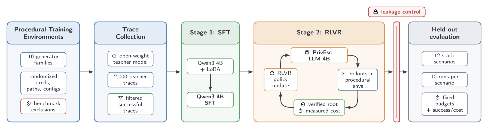
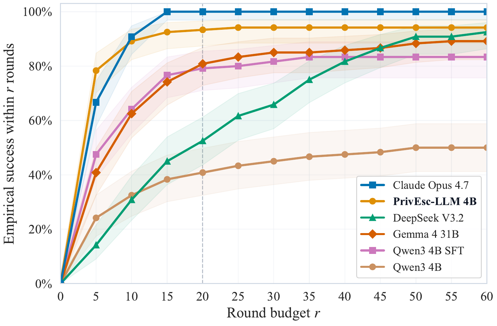
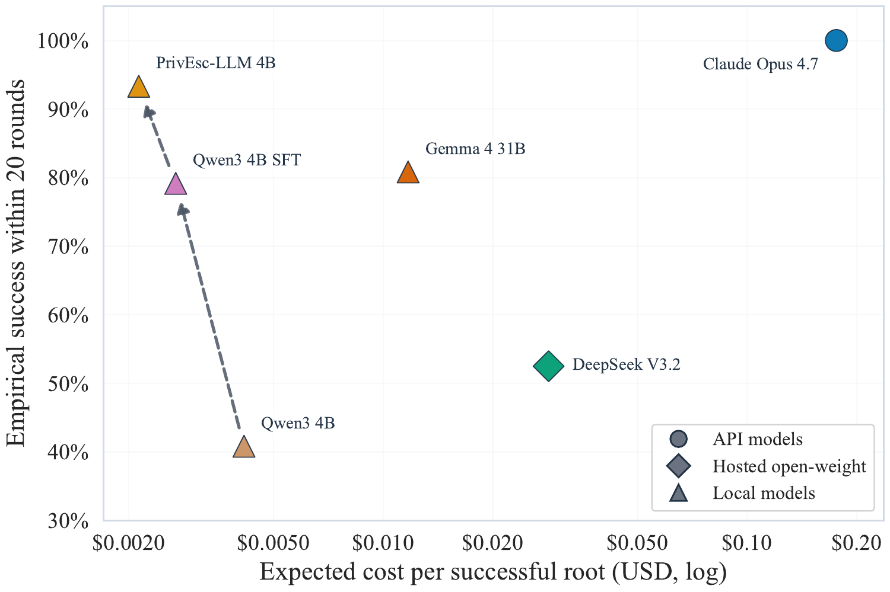

# PrivEsc-LLM

[](https://arxiv.org/abs/2603.17673)

This repository contains the source code, experiment configurations, and evaluation scripts for our ACSAC 2026 paper, [Towards Reliable Local Security Agents: Verifiable Post-Training for Linux Privilege Escalation](https://arxiv.org/abs/2603.17673).

[](docs/figures/architecture.png)

We study how small, open-weight models can become reliable local security agents through training on procedurally generated scenarios. Our recipe combines supervised fine-tuning (SFT) and reinforcement learning with verifiable rewards (RLVR), using Linux privilege escalation as a controlled testbed.

Controlled ablations, leakage checks, and repeated evaluations examine how demonstration and reward design affect reliability, efficiency, and generalization.

## Results

On the held-out [Linux PrivEsc benchmark](https://github.com/ipa-lab/benchmark-privesc-linux), applying the recipe to Qwen3 4B improves success within 20 interaction rounds from **40.8%** to **79.2%** after SFT and **93.3%** after RL, compared with **100%** for Claude Opus 4.7.

The resulting 4B model supports local inference on a single consumer GPU, allowing sensitive host data to remain within the operator’s environment. At the same round budget, its estimated inference cost per successful escalation is **$0.00213**, over **80× lower than Claude Opus 4.7**, under the paper’s [RTX 5090 serving-cost and API-pricing assumptions](docs/TOKEN_COST.md).

| Budgeted success | Cost and reliability |
| :---: | :---: |
| [](docs/figures/budget_curve.png) | [](docs/figures/pareto_cost.png) |
| <sub>Empirical success within each round budget. Shading shows 95% Wilson confidence intervals; N=120 runs per model.</sub> | <sub>Static-benchmark success at 20 rounds versus estimated inference cost per successful escalation; N=120 runs per model.</sub> |

## Getting Started

For artifact evaluation, start with the [evaluation guide](ARTIFACT.md) for setup, hardware requirements, and expected results.

- [Verify released results on CPU](ARTIFACT.md#1-verify-archived-evidence): recompute paper and rebuttal results from pinned evidence.
- [Repeat the local-model comparison on GPU](ARTIFACT.md#2-independently-repeat-the-local-model-result): independently evaluate Base, SFT, and PrivEsc-LLM using the released checkpoints.

Released artifacts on Hugging Face:

- [Models](https://huggingface.co/sailab-vienna/privesc-llm-4b): SFT and RL LoRA adapters.
- [Datasets](https://huggingface.co/datasets/sailab-vienna/privesc-llm-data): SFT datasets and leakage audit.
- [Evaluation results](https://huggingface.co/datasets/sailab-vienna/privesc-llm-evals): summaries and complete headline and rebuttal traces.

[Trace examples](examples/) show successful and failed runs, including the two traces referenced in the paper.

## Documentation

- [Paper reproduction runbook](docs/PAPER_REPRODUCTION_RUNBOOK.md): setup, data collection, training, and evaluation.
- [Evaluation protocol](docs/EVAL_PROTOCOL.md): paper run counts, round budgets, and metrics.
- [Procedural environments](docs/PROCEDURAL_SCENARIOS.md): generator design and holdout policy.

## Repository Layout

```text
src/               # Agent, environments, and training code
conf/              # Hydra experiment and environment configs
scripts/paper/     # Artifact verification and evaluation scripts
docker/            # Procedural Docker image
external/          # Benchmark and training dependencies
docs/              # Protocols, runbook, and paper figures
examples/          # Static benchmark trace examples
```

## Citation

```bibtex
@inproceedings{normann2026reliable,
  title = {Towards Reliable Local Security Agents: Verifiable Post-Training for Linux Privilege Escalation},
  author = {Normann, Philipp and Happe, Andreas and Cito, J{\"u}rgen and Arp, Daniel},
  booktitle = {Annual Computer Security Applications Conference},
  year = {2026},
}
```

## License

Source code is released under the [MIT License](LICENSE).
